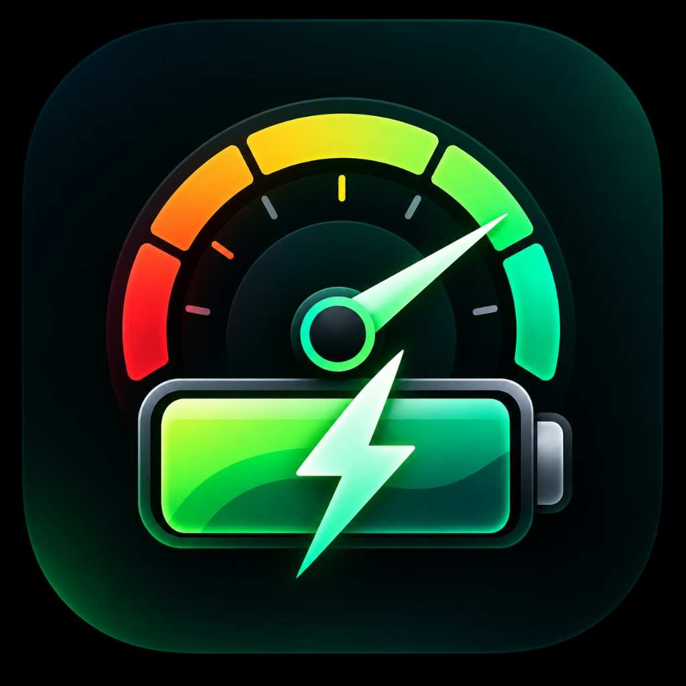
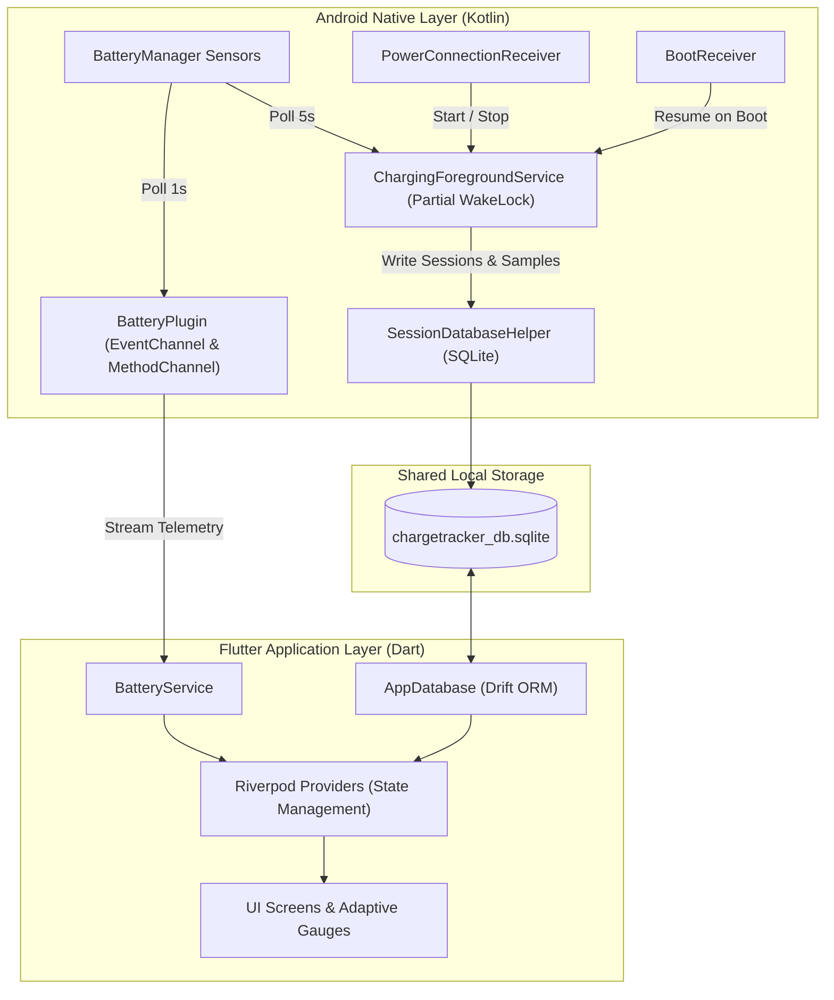

# ⚡ Charge Tracker

<p align="center">
  
</p>

<p align="center">
  <b>100% Offline · Zero Fake Data · Real-Time Battery Hardware Telemetry & Charging Analytics</b>
</p>

<p align="center">
  
  
  
  
  
  
</p>

<p align="center">
  <a href="https://github.com/sujalmittal123/chargeeasy/releases/latest">
    
  </a>
</p>

---

## 📥 Download APK
You can download the compiled and signed release APK directly from GitHub:
- **Latest Release**: [Download ChargeTracker-v1.0.4.apk](https://github.com/sujalmittal123/chargeeasy/releases/latest)
- **All Versions**: [View All GitHub Releases](https://github.com/sujalmittal123/chargeeasy/releases)

---

## 📖 Overview

**Charge Tracker** (`chargetracker.app`) is a high-precision, offline-first Android battery monitoring and analytics application built with Flutter and native Kotlin. Unlike typical battery apps that show hardcoded animations or simulated numbers, Charge Tracker is engineered under a strict **Zero Fake Data** principle:

> **Every single number, curve, and estimate is derived directly from live device hardware sensors or from your local SQLite database. If data has not accumulated yet, the app displays honest empty states (`--` or `Calculating...`), never dummy values.**

---

## 🌟 Key Features

### 1. 🎛️ Dynamic Dashboard & Real-Time Telemetry
- **1-Second EventChannel Stream**: Polls raw hardware readings directly from Android's `BatteryManager` (`CURRENT_NOW`, `voltage`, `temperature`, `level`, `status`, `plugged`, `health`, and `technology`).
- **Mathematically Derived Power**: Real wattage is calculated dynamically on every tick:
  $$\text{Power (W)} = |\text{Voltage (V)} \times \text{Current (A)}|$$
  Never stored as a constant or estimated guess.
- **Dynamic Drain & Charge Rates (%/h)**: Derived from a rolling 10–15 minute window of actual battery level transitions.
- **Rolling Current Time Estimations**:
  - *Discharging*: Remaining battery life computed from $\frac{\text{remaining mAh}}{\text{avg mA}}$ over a rolling 5-minute window.
  - *Charging*: Time to full computed from $\frac{\text{design capacity} - \text{current mAh}}{\text{avg mA}}$, supplemented by Android 9+ OEM machine-learned charge ETAs (`computeChargeTimeRemaining`).
- **Live 60-Sample Wattage Curve**: Starts empty upon launch and progressively plots incoming real sensor power.
- **Adaptive Speedometer Gauge**:
  - Automatically scales from 2,000 mA up to 8,000 mA based on charger capabilities (supports 18W, 33W, 65W, 120W+ fast chargers).
  - High-visibility color states: **Bright Green** (`#00E676`) when charging, **Bright Red** (`#FF5252`) when discharging.

---

### 2. 🔄 Background Session Logging (Screen-Off Tracking)
- **Automatic Broadcast Receivers**:
  - `PowerConnectionReceiver` detects `ACTION_POWER_CONNECTED` and triggers `ChargingForegroundService`.
  - Automatically finalizes and saves the session on `ACTION_POWER_DISCONNECTED`.
- **Screen-Off Persistence**: Holds an Android `PARTIAL_WAKE_LOCK` to ensure continuous 5-second sampling while the phone is locked and display is powered off.
- **Reboot Survivability**: `BootReceiver` listens to `BOOT_COMPLETED` and checks sticky `ACTION_BATTERY_CHANGED` broadcasts to resume monitoring seamlessly if rebooted while plugged in.
- **Shared SQLite Architecture**: Native Kotlin writes directly into `chargetracker_db.sqlite` (sharing the exact SQLite database file utilized by Dart's Drift ORM).
- **Intelligent Noise Filtering**: Automatically discards test unplugs and micro-sessions lasting shorter than 60 seconds or having less than 1% level change.

---

### 3. 📈 Charging History & Wattage Analysis
- **Dynamic Aggregate Metrics**: Database computes true lifetime metrics (Total Sessions, Avg Speed in W, Avg Charge Duration), showing `"--"` when fresh.
- **Horizontal Filter Chips**: Filter sessions by **All**, **Fast** ($\ge 15\text{W}$), **Wired**, or **Wireless**.
- **Interactive Session Detail**: Tap any historical session to view the exact wattage-versus-percentage ($W$ vs. $\%$) curve recorded from individual 5-second sensor samples.

---

### 4. 🩺 Battery Health & Cycle Degradation
- **Capacity Diagnostics**: Calculates real health percentage from qualifying sessions with $\ge 30\%$ charge delta:
  $$\text{Health \%} = \frac{\Delta\text{Charge Counter}}{\Delta\text{Battery Level \%}} \times 100$$
- **Cumulative Cycle Counter**: Sums all historical charge percentage deltas:
  $$\text{Cycle Count} = \frac{\sum \Delta\%}{100}$$
- **Health Trend Graph**: Tracks daily health snapshots over time with honest empty states (*"Collecting data — check back in a few days"*).

---

### 5. 📑 PDF/CSV Reports & AI Coaching
- **Rule-Based On-Device AI Tips**: Evaluates real thermal logs and charging habits (e.g. alerts when sessions exceed 40°C, or praises stopping charge near 80% to preserve lithium chemistry).
- **Multi-Page PDF Export**: Generates printable telemetry reports featuring session breakdowns, charger speeds, and thermal statistics.
- **CSV Data Export**: Full timestamped export for spreadsheet analysis.

---

### 6. 🔒 100% Offline & Privacy-First
- **Zero Internet Access**: `android.permission.INTERNET` is **NOT** present in the manifest.
- **Local Isolation**: All telemetry, logs, and database records remain strictly within the device's private sandbox.

---

## 🏗️ Architecture & Tech Stack



### Technology Matrix

| Layer | Component | Description |
|---|---|---|
| **Framework** | Flutter 3.x / Dart 3.x | Cross-platform UI toolkit with declarative rendering |
| **State Management** | Flutter Riverpod 2.6+ | Reactive state management with code-generation (`riverpod_generator`) |
| **Database** | Drift 2.19+ & SQLite3 | Type-safe persistence shared between Dart and native Kotlin |
| **Navigation** | GoRouter 13.x | Declarative URL-based routing |
| **Native Interop** | Kotlin 2.x | Low-level Android API hooks via `EventChannel` and `MethodChannel` |
| **Charting** | `fl_chart` 0.68+ | Hardware-accelerated interactive power and health curves |
| **Reporting** | `pdf` 3.11+ & `csv` 6.0+ | Document generation for local sharing |
| **Audio & Haptics** | `audioplayers` & `vibration` | Guard Mode alerts and charge limit notifications |

---

## 📂 Project Directory Structure

```text
charge-easy/
├── android/
│   ├── app/
│   │   ├── build.gradle                          # Android build configuration & signing
│   │   └── src/main/
│   │       ├── AndroidManifest.xml              # Permissions, receivers & services
│   │       ├── kotlin/chargetracker/app/
│   │       │   ├── BatteryPlugin.kt             # EventChannel & MethodChannel native bridge
│   │       │   ├── BootReceiver.kt              # Boot completion resume handler
│   │       │   ├── ChargeTrackerWidget.kt       # Home screen AppWidgets (2x1 and 4x2)
│   │       │   ├── ChargingForegroundService.kt # Background logging service & WakeLock
│   │       │   ├── MainActivity.kt              # Main FlutterActivity
│   │       │   ├── PowerConnectionReceiver.kt   # ACTION_POWER_CONNECTED/DISCONNECTED listener
│   │       │   ├── SessionDatabaseHelper.kt     # Shared SQLite database helper
│   │       │   ├── UsageStatsHelper.kt          # On-device app power attribution
│   │       │   └── WorkManagerHelper.kt         # Periodic background health workers
│   │       └── res/                             # Launcher icons, widget layouts, XMLs
│   └── key.properties                           # Release signing configuration
├── assets/
│   ├── images/
│   │   ├── logo.png                             # Master high-res application logo
│   │   └── app_icon.png                         # App icon asset
│   └── sounds/                                  # Alarm audio files
├── lib/
│   ├── data/
│   │   ├── database/                            # Drift database schema & DAOs
│   │   │   ├── app_database.dart
│   │   │   └── daos/                            # Sessions, Samples, Health, Chargers DAOs
│   │   └── services/                            # BatteryService platform channel client
│   ├── domain/
│   │   ├── models/                              # Immutable Freezed domain models
│   │   └── use_cases/                           # Pure business logic & calculation algorithms
│   │       ├── compute_time_estimate.dart       # Rolling backup/charge time estimations
│   │       ├── estimate_battery_health.dart     # Health % & cycle calculations
│   │       └── export_sessions.dart             # PDF & CSV generation
│   ├── providers/                               # Riverpod state providers
│   ├── ui/
│   │   ├── core/                                # Theme, router, and reusable widgets
│   │   │   └── widgets/
│   │   │       ├── analog_speedometer_gauge.dart # Adaptive dynamic speedometer
│   │   │       └── mini_dial_gauge.dart         # FittedBox dial cards
│   │   └── features/                            # Feature screens
│   │       ├── dashboard/                       # Live telemetry & speed gauge
│   │       ├── history/                         # Saved sessions & filters
│   │       ├── session_detail/                  # W-vs-% power curve inspection
│   │       ├── health/                          # Health diagnostics & cycle stats
│   │       ├── reports/                         # Daily bar charts & AI tips
│   │       ├── calibration/                     # Hardware sensor sign & scale calibrator
│   │       ├── onboarding/                      # 3-step welcome walkthrough
│   │       └── settings/                        # Alarms, theme, and OEM whitelist help
│   └── main.dart                                # Application bootstrap & ProviderScope
├── test/
│   └── use_cases_test.dart                      # Comprehensive unit tests
└── pubspec.yaml                                 # Flutter dependencies & metadata
```

---

## 🛠️ Hardware Telemetry & Sensor Calibration

Android devices from different manufacturers (Samsung, Xiaomi, OnePlus, Google, etc.) expose battery sensors using varying conventions. Charge Tracker automatically normalizes these differences:

1. **Microamp ($\mu\text{A}$) vs. Milliamp ($\text{mA}$) Detection**:
   - Standard Android `CURRENT_NOW` is in microamps ($\mu\text{A}$).
   - If $|I| > 20,000$, Charge Tracker automatically divides by $1,000$ to display milliamps ($\text{mA}$).
2. **Current Sign Inversion**:
   - Certain OEM kernels report charging current as negative and discharging as positive.
   - Charge Tracker includes a built-in **Sensor Calibration** wizard (accessible via Dashboard menu) allowing users to calibrate direction.
3. **Hardware Capacity Auto-Discovery**:
   - Queries Android internal `PowerProfile.getBatteryCapacity()` via reflection.
   - Falls back to `BATTERY_PROPERTY_CHARGE_COUNTER / percent` or sysfs capacity nodes (`/sys/class/power_supply/battery/charge_full`).
   - If unknown, prompts the user once with an explicit input dialog rather than defaulting to an arbitrary value.

---

## 🔋 OEM Background Optimization Setup

Because Charge Tracker logs charging sessions with the screen turned off, certain aggressive battery management features (common in MIUI, One UI, ColorOS) might terminate background services. To ensure uninterrupted logging:

| OEM / ROM | Recommended Settings |
|---|---|
| **Xiaomi / Poco / MIUI** | *Security app → Manage Apps → Charge Tracker → Enable "Autostart" and set Battery Saver to "No restrictions".* |
| **Samsung One UI** | *Settings → Apps → Charge Tracker → Battery → Select "Unrestricted".* |
| **OnePlus / Oppo / Realme** | *Settings → Battery → More Settings → App Battery Management → Charge Tracker → Allow background activity.* |
| **Vivo / Funtouch OS** | *Settings → Battery → High background power consumption → Enable Charge Tracker.* |
| **Google Pixel / Stock Android** | *Settings → Apps → Charge Tracker → App battery usage → Select "Unrestricted".* |

---

## 🚀 Building & Running

### Prerequisites
- [Flutter SDK](https://flutter.dev/docs/get-started/install) (`>= 3.22.0`)
- [Android SDK](https://developer.android.com/studio) (API 26 to 36)
- Java Development Kit (JDK 17 or JDK 21)

### 1. Clone & Install Dependencies
```bash
git clone https://github.com/your-username/charge-tracker.git
cd charge-tracker
flutter pub get
```

### 2. Run Static Analysis & Unit Tests
```bash
# Verify static analysis (0 warnings / errors)
dart analyze

# Run unit tests (13 test suites)
flutter test
```

### 3. Debug Run on Connected Device
```bash
# Connect phone via USB with USB Debugging enabled
flutter run
```

### 4. Build Signed Release APK
Charge Tracker is pre-configured with release signing via `android/key.properties`:
```bash
flutter build apk --release --android-skip-build-dependency-validation
```
The output APK is generated at:
```text
build/app/outputs/flutter-apk/app-release.apk
```

---

## 🛡️ Permissions & Security

Charge Tracker requests only the bare minimum permissions necessary for hardware telemetry and screen-off tracking:

```xml
<!-- Foreground service to log charging while screen is off -->
<uses-permission android:name="android.permission.FOREGROUND_SERVICE" />
<uses-permission android:name="android.permission.FOREGROUND_SERVICE_DATA_SYNC" />

<!-- Resume tracking after device reboot if plugged in -->
<uses-permission android:name="android.permission.RECEIVE_BOOT_COMPLETED" />

<!-- Post charging status and 80% limit alerts -->
<uses-permission android:name="android.permission.POST_NOTIFICATIONS" />
<uses-permission android:name="android.permission.VIBRATE" />

<!-- Prevent CPU sleep during active charging sessions -->
<uses-permission android:name="android.permission.WAKE_LOCK" />

<!-- Disconnection guard alarm scheduling -->
<uses-permission android:name="android.permission.SCHEDULE_EXACT_ALARM" />
```

> **Notice**: `android.permission.INTERNET` is intentionally omitted. No network sockets can be opened by this application.

---

## 📄 License & Credits

Developed with ❤️ by the **Charge Tracker Team**.  
Pure offline-first battery analytics.